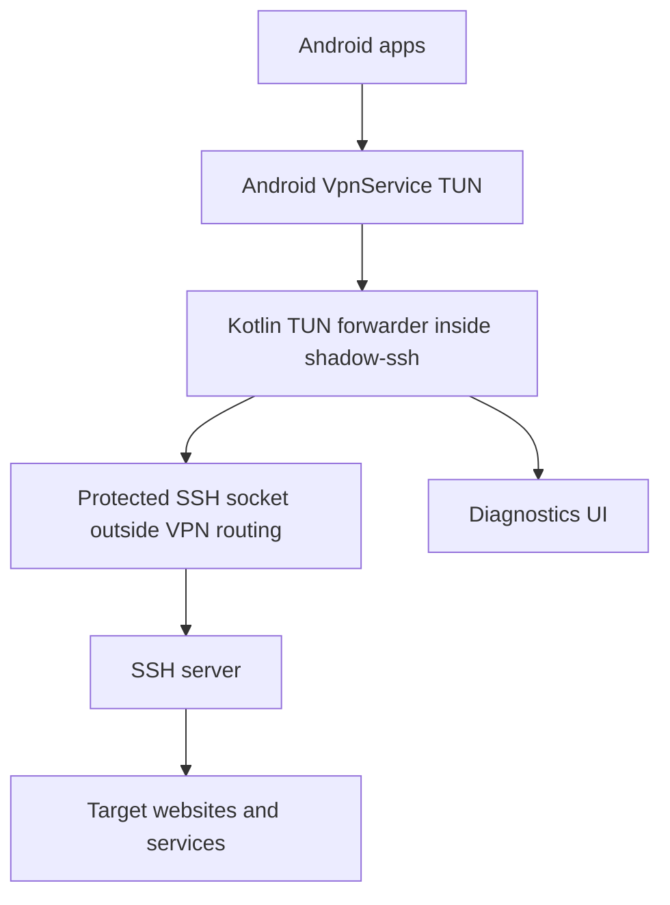
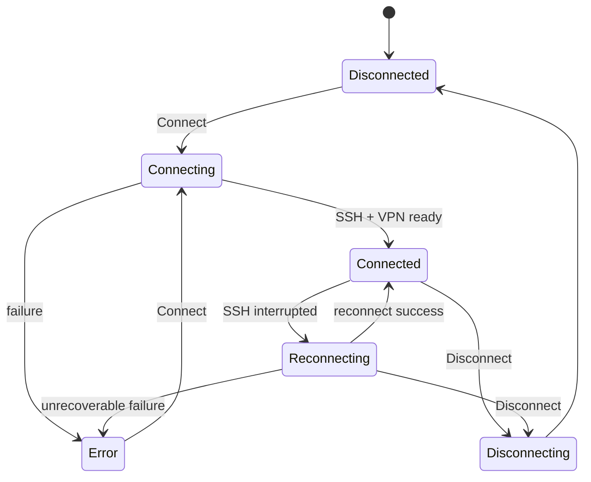

# shadow-ssh - описание для системного аналитика

## Назначение

`shadow-ssh` - Android-приложение, которое создаёт локальный VPN-интерфейс на устройстве и использует SSH-сервер как транспорт до внешних сайтов и сервисов.

Цель пользователя: выбрать SSH-конфигурацию, подключиться и направить сетевой трафик приложений через SSH-туннель без изменения серверной части.

## Участники

- Пользователь Android-устройства.
- Android OS:
  - выдаёт VPN permission;
  - создаёт `VpnService` TUN interface;
  - применяет split tunneling по package names;
  - отображает Quick Settings tile.
- Приложение `shadow-ssh`.
- SSH-сервер пользователя.
- Внешние сайты и сервисы.

## Общая схема трафика



Приложение защищает SSH socket от попадания обратно в VPN routing. Иначе SSH-соединение начало бы маршрутизироваться через собственный VPN-интерфейс и соединение могло бы зависнуть или оборваться.

## Основной сценарий подключения

1. Пользователь создаёт или выбирает SSH-конфигурацию.
2. Пользователь добавляет SSH private key или пароль.
3. Пользователь нажимает `Connect`.
4. Приложение проверяет:
   - выбрана ли конфигурация;
   - есть ли VPN permission;
   - если выбран режим `Selected apps`, выбран ли хотя бы один package.
5. Android создаёт VPN TUN interface.
6. Приложение открывает защищённый TCP socket до SSH-сервера.
7. SSH-клиент проходит аутентификацию.
8. Приложение запускает Kotlin TUN forwarding layer.
9. TCP-трафик приложений открывается через SSH `direct-tcpip`.
10. DNS-запросы обрабатываются как DNS-over-TCP через SSH.
11. Статус на главном экране становится `Connected`.

## Режимы VPN

### Proxy

Через туннель идут все приложения, которые Android направляет в VPN.

Использование: режим по умолчанию для пользователя, которому нужен полный VPN.

### Selected apps

Через туннель идут только выбранные приложения.

Особенности:

- список приложений включает пользовательские и системные приложения;
- есть поиск;
- выбор сохраняется после перезапуска;
- если список пустой, подключение запрещается и показывается сообщение `нет выбранных приложений`;
- при изменении списка или режима во время активного VPN приложение делает controlled reconnect.

## Состояния подключения



Reconnect продолжается до явного `Disconnect`. Backoff ограничен диапазоном от 2 до 30 секунд.

## Диагностика

Diagnostics нужны для пользовательского debug без adb.

Пишутся:

- выбранная конфигурация без секретов;
- auth type;
- Android network capabilities;
- результат защиты SSH socket;
- SSH connect/auth lifecycle;
- fingerprint server/key;
- reconnect attempts;
- tunnel check result;
- terminal lifecycle/failures;
- forwarding layer warnings.

Не пишутся:

- private key;
- password;
- passphrase;
- terminal commands;
- terminal remote output.

Diagnostics по умолчанию скрыты на главном экране. В Settings есть переключатель `Debug logs`. Если он включён, на главном экране появляется свёрнутый блок diagnostics с кнопкой копирования.

## Check tunnel

Кнопка `Check tunnel` доступна после успешного подключения.

Проверка открывает SSH `direct-tcpip` channel до:

```text
youtube.com:443
```

Результат отображается цветом кнопки:

- серый - проверка ещё не выполнялась;
- зелёный - проверка успешна;
- красный - проверка неуспешна.

## SSH terminal

Terminal - дополнительный пользовательский инструмент, доступный при активном подключении.

Поведение:

- открывает SSH shell-channel на текущей SSH-сессии;
- работает в expandable panel на главном экране;
- ввод команд выполняется через Android keyboard;
- network write выполняется на IO-потоке, не на UI thread;
- при Disconnect shell-channel закрывается;
- terminal output хранится только в UI state и не попадает в diagnostics.

Терминал не является отдельным VPN-транспортом. Он использует ту же SSH-сессию, что и VPN.

## Хранение данных

Обычные данные:

- SSH configuration metadata;
- SSH key metadata;
- selected config;
- settings;
- selected app package names.

Секреты:

- SSH password;
- private key;
- private key passphrase.

Секреты не хранятся в Room. В Room хранится только secret id.

Активная схема secret storage:

- Tink AEAD;
- ciphertext в обычном private `SharedPreferences`;
- Base64 encoding;
- associated data = secret id;
- keyset через Android Keystore-backed `AndroidKeysetManager`.

Есть legacy migration из старого `EncryptedSharedPreferences`. Deprecated storage используется только как источник старых данных во время миграции.

## UI settings

Настройки сохраняются после перезапуска приложения:

- `Debug logs`;
- theme mode:
  - `System`;
  - `Light`;
  - `Dark`;
  - `Custom`;
- RGB-цвета для `Custom`;
- VPN mode;
- selected app package names.

## Quick Settings tile

Android Quick Settings tile называется `shadow-ssh`.

Поведение:

- если VPN подключён, подключается или переподключается - тап отправляет Disconnect;
- если VPN отключён - тап запускает текущую выбранную конфигурацию;
- если требуется действие пользователя, открывается главный экран.

Tile нельзя автоматически добавить в шторку или поставить в конкретную позицию. Это ограничение Android.

## Технические ограничения

- Поддержаны TCP и DNS UDP/53.
- Произвольный non-DNS UDP не проксируется.
- SSH-серверная часть не меняется.
- Производительность зависит от:
  - latency до SSH-сервера;
  - производительности устройства;
  - cipher/KEX SSH-сессии;
  - количества параллельных TCP-соединений;
  - сетевых ограничений оператора или Wi-Fi.
- Интерактивный terminal зависит от shell defaults на сервере.

## Сборочные артефакты

Debug APK:

```text
app/build/outputs/apk/debug/app-debug.apk
```

Release APK:

```text
app/build/outputs/apk/release/app-release.apk
```

Release APK:

- локально подписывается автоматически, если production signing env не задан;
- использует R8 minification;
- использует resource shrinking;
- проверяется через `apksigner verify --verbose`.

## Acceptance checklist

- Пользователь может создать SSH-конфигурацию.
- Пользователь может добавить private key без passphrase.
- Connect создаёт VPN и SSH-сессию.
- Disconnect останавливает VPN.
- При обрыве SSH приложение переподключается.
- В `Selected apps` без выбранных приложений Connect запрещён.
- Diagnostics копируются в clipboard.
- Check tunnel меняет состояние кнопки.
- Terminal принимает команды без `NetworkOnMainThreadException`.
- Release APK устанавливается на устройство.
