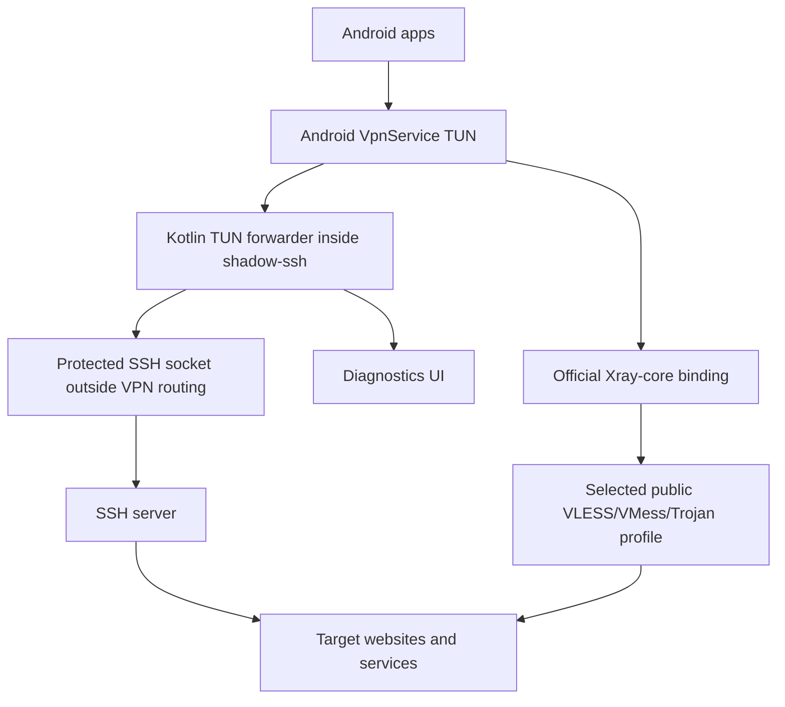
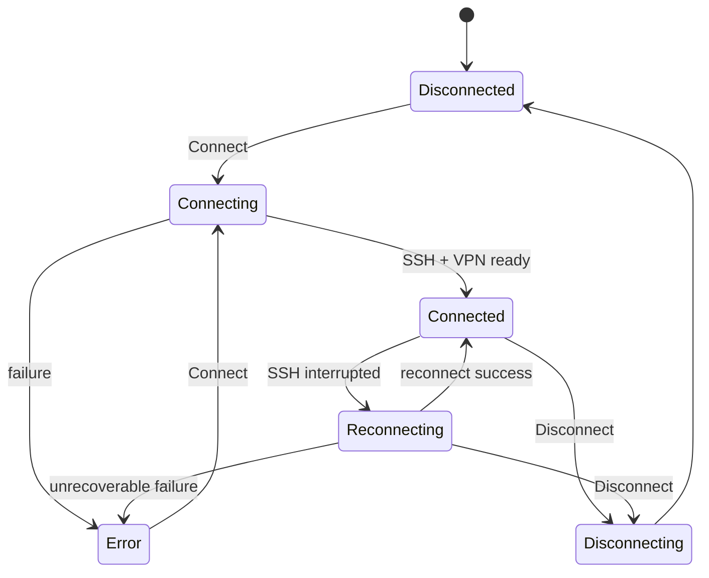

# shadow-ssh - описание для системного аналитика

## Назначение

`shadow-ssh` - Android-приложение, которое создаёт локальный VPN-интерфейс на устройстве и использует SSH-сервер или публичный Xray-compatible proxy profile как транспорт до внешних сайтов и сервисов.

Цель пользователя: выбрать SSH-конфигурацию или публичный `opensource` профиль, подключиться и направить сетевой трафик приложений через выбранный туннель без изменения серверной части.

## Участники

- Пользователь Android-устройства.
- Android OS:
  - выдаёт VPN permission;
  - создаёт `VpnService` TUN interface;
  - применяет split tunneling по package names;
  - отображает Quick Settings tile.
- Приложение `shadow-ssh`.
- SSH-сервер пользователя.
- Публичный proxy-сервер из `opensource` конфигурации.
- Публичный источник списков конфигураций.
- Внешние сайты и сервисы.

## Общая схема трафика



Приложение защищает SSH socket от попадания обратно в VPN routing. Иначе SSH-соединение начало бы маршрутизироваться через собственный VPN-интерфейс и соединение могло бы зависнуть или оборваться.

Для `opensource` режима приложение передаёт TUN fd официальному Xray-core Android binding. Xray сам управляет выбранным публичным протоколом и транспортом, а приложение отвечает за UI, storage, split tunneling, lifecycle, socket protect и проверку доступности.

## Основной сценарий подключения

1. Пользователь создаёт или выбирает SSH-конфигурацию.
2. Пользователь добавляет SSH private key или пароль.
3. Пользователь нажимает `Connect`.
4. Приложение проверяет:
   - выбрана ли конфигурация;
   - есть ли VPN permission;
   - если выбран режим `Selected apps`, выбран ли хотя бы один package.
5. Приложение открывает защищённый TCP socket до SSH-сервера.
6. SSH-клиент проходит аутентификацию.
7. Android создаёт VPN TUN interface.
8. Приложение запускает Kotlin TUN forwarding layer с текущей SSH-сессией.
9. TCP-трафик приложений открывается через SSH `direct-tcpip`.
10. DNS-запросы обрабатываются как DNS-over-TCP через SSH.
11. Статус на главном экране становится `Connected`.

## Сценарий opensource

`opensource` - отдельная глобальная вкладка рядом с `shadow-ssh`.

Первый вход:

1. Пользователь открывает вкладку `opensource`.
2. Приложение показывает предупреждение: публичные конфигурации используются на риск пользователя, разработчик/автор приложения не несёт ответственности за их безопасность и безопасность пользователя.
3. Если пользователь нажимает `Нет`, приложение возвращает его на вкладку `shadow-ssh`.
4. Если пользователь нажимает `Согласен`, версия согласия сохраняется в settings. При изменении текста предупреждения можно поднять версию и показать согласие заново.
5. На экране `opensource` всегда остаётся риск-баннер.

Импорт и синхронизация:

- Публичный список загружается из `https://hub.mos.ru/zieng2/wl/raw/main/list_universal.txt`.
- Автосинхронизация выключена по умолчанию. Если пользователь включает её в настройках, WorkManager планирует sync каждые 12 часов с flex-окном 4 часа при unmetered-сети, не низком заряде батареи и принятом предупреждении. Worker дополнительно выбирает физическую сеть с `INTERNET + VALIDATED + NOT_VPN + NOT_METERED` и открывает HTTP через `Network.openConnection`; при отсутствии такой сети запуск пропускается без retry.
- VPN runtime не держит для sync собственный long-lived wake lock; WorkManager/Android могут использовать кратковременный управляемый ими wake lock только во время фактического выполнения worker.
- Пользователь может нажать `Refresh` вручную.
- Пользователь может добавить один share link вручную или импортировать bulk-текст из clipboard.
- Поддерживаются share links `vless://`, `vmess://`, `trojan://`.
- Дубли удаляются по canonical fingerprint.
- Исходный share link хранится как секрет; Room хранит metadata, fingerprint и UI-состояние.

Работа со списком:

- Тап по профилю делает его активным.
- Рядом с профилем доступны `Copy`, `Edit`, `Delete`.
- Долгое нажатие включает multi-select.
- В multi-select можно выбрать все профили и удалить выбранные.
- Профили можно фильтровать поиском и по протоколу.
- `Remove all unavailable tunnels except pinned` удаляет только неприкреплённые `UNAVAILABLE` profiles после подтверждения.

Подключение и проверка:

1. Пользователь выбирает профиль.
2. Пользователь нажимает `Connect`.
3. Если сейчас активен SSH VPN, приложение сначала отправляет controlled disconnect.
4. Запускается отдельный `OpenSourceVpnService`.
5. Android создаёт TUN interface с теми же split tunneling правилами.
6. Xray-core получает TUN fd и JSON-конфиг выбранного профиля.
7. Статус приложения становится `Connected`.

Для OpenSource Android VPN получает IPv4 и IPv6 address/default routes/DNS. Physical network выбирается как active, затем уже используемая current network, затем validated fallback; временно unvalidated cellular с `INTERNET + NOT_VPN` не блокируется. libXray DNS направляется через DNS выбранной physical network, а outbound fd сначала защищается от VPN loop и только затем best-effort привязывается к `Network`.

`Check selected` и `Check all` загружают нужные profiles одним batch и поднимают один временный Xray runtime. Authenticated SOCKS inbound слушает только `127.0.0.1`; уникальный username каждого profile маршрутизируется в его собственный tagged outbound. Через этот runtime приложение параллельно делает реальные HTTPS probes к YouTube с timeout до 2 секунд и transient concurrency не выше 128; Battery Saver использует nominal cap 64, Android low-RAM — 32, с минимальным повышением только если очень большой batch иначе не помещается в 60 секунд. Для примерно 500 profiles целевое время normal mode составляет около 10 секунд, защитный общий budget — 60 секунд. Непроверенный до hard deadline хвост получает `NOT_TESTED`, а не `UNAVAILABLE`. UI показывает live completed/total, invalid profile изолируется и не срывает весь batch, а terminal results сохраняются одной Room-транзакцией без persistent `RUNNING`. Xray sockets привязываются к физической `NOT_VPN` сети; после проверки probe workers не остаются в фоне. Поскольку native start/stop является blocking JNI, 10/60-секундные границы остаются best-effort при аномально зависшем вызове, который Kotlin не может безопасно уничтожить.

## Режимы VPN

### Proxy

Через туннель идут все приложения, которые Android направляет в VPN.

Использование: режим по умолчанию для пользователя, которому нужен полный VPN.

### Selected apps

Через туннель идут только выбранные приложения.

Особенности:

- список приложений включает пользовательские и системные приложения;
- есть поиск;
- выбор сохраняется после перезапуска;
- если список пустой, подключение запрещается и показывается сообщение `нет выбранных приложений`;
- при изменении списка или режима во время активного VPN приложение делает controlled reconnect.

## Состояния подключения



Reconnect продолжается до явного `Disconnect`.

При обычном разрыве SSH приложение не закрывает Android VPN interface:

1. Статус меняется на `Reconnecting`.
2. Kotlin TUN forwarder отвязывается от старой SSH-сессии и закрывает связанные с ней TCP flow.
3. Первый SSH reconnect запускается без искусственной задержки.
4. После успешной аутентификации новая JSch `Session` подставляется в существующий forwarder.
5. Статус возвращается в `Connected`.

Повторные неудачи используют backoff от 250 ms до 30 секунд. SSH reconnect использует timeout 8 секунд. При отсутствии usable `INTERNET + NOT_VPN` physical network loop приостанавливается до callback, а не выполняет периодические попытки. Если VPN interface или TUN forwarder недоступен, приложение выполняет полный rebuild pipeline.

SSH socket и DNS до подключения привязываются к Android-сети с `INTERNET + NOT_VPN`; `VALIDATED` предпочтителен, но cellular допускается как fallback. При handoff Wi-Fi/mobile сервис обновляет underlying network и пересоздаёт внешний SSH transport, не отправляя его обратно в VPN route.

Существующие TCP/TLS flow не переносятся между SSH-сессиями и должны быть переоткрыты клиентским приложением. Новые SYN во время короткой паузы временно не отклоняются, поэтому TCP stack Android может повторить их после восстановления transport.

### Возврат из Doze/блокировки экрана

SSH transport может оставаться доступным после сна устройства, пока отдельные TCP/TLS/DoT соединения приложений уже стали недействительными из-за NAT timeout или приостановки сети. Поэтому успешный `Check tunnel` сам по себе не гарантирует жизнеспособность старых app sockets.

Если экран был выключен не менее 5 минут, приложение после двухсекундной стабилизации сети один раз проверяет SSH transport. Только при неуспешной проверке сбрасываются TUN-сессии с idle не менее 2 минут и запускается reconnect; исправный короткий сон не создаёт сетевого churn.

Сам механизм wake recovery не захватывает wake lock, не запускает периодические ping или новый polling и не будит устройство во время сна.

Если SSH session остаётся живой, но DNS или TUN forwarding начинают массово отказывать, приложение считает это деградацией forwarding layer. DNS сначала идёт как DNS-over-TCP через SSH к DNS-серверу из Android VPN settings. Если TCP/53 не отвечает, forwarder пробует DoH fallback к Cloudflare через SSH на порт 443. Если несколько DNS-запросов подряд не проходят даже после fallback, `SshVpnService` пересобирает Android VPN interface и Kotlin forwarder. Это закрывает сценарий, когда `Check tunnel` зелёный, но браузер и приложения не открывают сайты.

## Диагностика

Diagnostics нужны для пользовательского debug без adb.

Пишутся:

- выбранная конфигурация без секретов;
- auth type;
- Android network capabilities;
- результат защиты SSH socket;
- SSH connect/auth lifecycle;
- fingerprint server/key;
- reconnect attempts;
- tunnel check result;
- terminal lifecycle/failures;
- forwarding layer warnings.

Не пишутся:

- private key;
- password;
- passphrase;
- terminal commands;
- terminal remote output.

Diagnostics по умолчанию скрыты на главном экране. В Settings есть переключатель `Debug logs`. Если он включён, на главном экране появляется свёрнутый блок diagnostics с кнопкой копирования.

Буфер ограничен 500 строками / 131 072 символами, длинные записи обрезаются, а адреса назначения из per-flow TUN diagnostics не сохраняются.

## Check tunnel

Кнопка `Check tunnel` доступна после успешного подключения.

Проверка открывает SSH `direct-tcpip` channel до:

```text
youtube.com:443
```

Результат отображается цветом кнопки:

- серый - проверка ещё не выполнялась;
- зелёный - проверка успешна;
- красный - проверка неуспешна.

Важно: эта проверка подтверждает живость SSH transport. Она не является полной проверкой Android TUN, DNS forwarding и старых app sockets.

## SSH terminal

Terminal - дополнительный пользовательский инструмент, доступный при активном подключении.

Функция выключена по умолчанию и включается persisted-переключателем `SSH terminal` в Settings. Когда она выключена, terminal panel не создаётся, shell-channel не открывается, а уже активная terminal session немедленно закрывается.

Поведение:

- открывает SSH shell-channel на текущей SSH-сессии;
- работает в expandable panel на главном экране;
- ввод команд выполняется через Android keyboard;
- network write выполняется на IO-потоке, не на UI thread;
- при Disconnect shell-channel закрывается;
- terminal output хранится только в UI state и не попадает в diagnostics.
- output ограничен 65 536 символами, публикуется в UI батчами раз в 250 ms, а shell закрывается при collapse, уходе Activity в background или удалении экрана.

Терминал не является отдельным VPN-транспортом. Он использует ту же SSH-сессию, что и VPN.

## Хранение данных

Обычные данные:

- SSH configuration metadata;
- SSH key metadata;
- public proxy profile metadata;
- public proxy fingerprint and source;
- selected config;
- selected public proxy profile;
- settings;
- selected app package names.

Секреты:

- SSH password;
- private key;
- private key passphrase.
- raw public proxy share link.

Секреты не хранятся в Room. В Room хранится только secret id.

Активная схема secret storage:

- Tink AEAD;
- ciphertext в обычном private `SharedPreferences`;
- Base64 encoding;
- associated data = secret id;
- keyset через Android Keystore-backed `AndroidKeysetManager`.

Есть legacy migration из старого `EncryptedSharedPreferences`. Deprecated storage используется только как источник старых данных во время миграции.

В формах password, private key content и passphrase маскируются звёздочками по умолчанию. Кнопка глаза меняет только отображение текущего UI-поля и не изменяет способ хранения. Копирование private key/passphrase выполняется напрямую в Android clipboard и не попадает в diagnostics.

## UI settings

Настройки сохраняются после перезапуска приложения:

- `Debug logs`;
- `SSH terminal`;
- active global tab:
  - `shadow-ssh`;
  - `opensource`;
- accepted opensource warning version;
- theme mode:
  - `System`;
  - `Light`;
  - `Dark`;
  - `Custom`;
- RGB-цвета для `Custom`;
- VPN mode;
- selected app package names.

## Quick Settings tile

Android Quick Settings tile называется `shadow-ssh`.

Поведение:

- если VPN подключён, подключается или переподключается - тап отправляет Disconnect;
- если VPN отключён - тап запускает текущую выбранную конфигурацию;
- если требуется действие пользователя, открывается главный экран.

Tile нельзя автоматически добавить в шторку или поставить в конкретную позицию. Это ограничение Android.

## Обновление приложения

При запуске главного экрана приложение автоматически проверяет GitHub Releases, но не чаще одного раза в 24 часа. В Settings также доступна ручная проверка.

Сценарий:

1. Выполняется публичный запрос `GET /repos/stansful/ssh-vpn-client-kotlin/releases/latest` без GitHub token.
2. `tag_name` сравнивается с установленным `versionName` по SemVer; поддерживаются tags с префиксом `v` и без него.
3. Если версия новее, показывается modal с release notes и действиями `Later`, `Open release`, `Download`; для уже проверенного APK действие меняется на `Install`.
4. `Open release` использует полученный от GitHub `html_url`.
5. `Download` передаёт `browser_download_url` системному DownloadManager. UI показывает процент и объём скачанных данных в сворачиваемой панели; системное скачивание продолжает работать независимо от открытого экрана.
6. После скачивания проверяются digest, package name, versionName, versionCode и signing certificate. Валидный APK и metadata сохраняются как `ReadyToInstall` после пересоздания процесса.
7. `Install` при необходимости направляет пользователя в системное разрешение `Install unknown apps`, затем передаёт APK стандартному Android installer, где пользователь подтверждает обновление.

Metadata проверки, незавершённой загрузки и проверенного APK сохраняются после пересоздания процесса. Ручная кнопка проверки остаётся доступной во время скачивания и визуально показывает выполняемую проверку. Одновременные network checks и повторные download jobs не дублируются. Прогресс опрашивается только во время активной загрузки и с более редким интервалом в paused-состоянии. Сетевые, JSON, hash и package операции выполняются вне Main thread.

Ограничения:

- Android не разрешает обычному приложению полностью бесшумную установку; требуется системное пользовательское подтверждение.
- Новый APK должен иметь больший `versionCode` и тот же signing certificate.
- Все production releases должны подписываться одним постоянным keystore.

## Технические ограничения

- Поддержаны TCP и DNS UDP/53.
- Произвольный non-DNS UDP не проксируется.
- SSH-серверная часть не меняется.
- SSH TUN использует MTU 8500/MSS 8460, bounded upload backpressure и единый TUN writer; JSch channel/socket/input windows равны 4 MiB во всех режимах. Battery Saver/low-RAM больше не уменьшают transport credit. Все изменения находятся на клиенте.
- Для `opensource` используется официальный Xray-core Android binding, собранный из закреплённых исходников.
- Публичные proxy-серверы не контролируются приложением. Пользователь принимает риск до входа во вкладку, риск-баннер остаётся всегда.
- Автосинхронизация публичных конфигов выключена по умолчанию; при включении планируется раз в 12 часов с flex 4 часа при unmetered-сети и не низком заряде, затем worker требует физическую `VALIDATED + NOT_VPN + NOT_METERED` сеть и привязывает HTTP к ней через `Network.openConnection`.
- Производительность зависит от:
  - latency до SSH-сервера;
  - latency и качества публичного proxy-сервера;
  - производительности устройства;
  - cipher/KEX SSH-сессии;
  - количества параллельных TCP-соединений;
  - сетевых ограничений оператора или Wi-Fi.
- Интерактивный terminal зависит от shell defaults на сервере.

## Производительность и устойчивость

- Тяжёлые компоненты Room, Tink и VPN создаются лениво, поэтому не блокируют холодный старт до фактической необходимости.
- UI-экраны читают только metadata. Расшифровка password/private key происходит на IO-потоке только для подключения или редактирования.
- Diagnostics bounded, публикуются пакетно раз в 250 ms и показываются виртуализированным списком.
- Неактивные Compose-экраны прекращают сбор Flow по lifecycle.
- Поиск приложений имеет debounce 200 ms, а результат PackageManager кэшируется на 5 минут.
- Иконки приложений декодируются максимум двумя параллельными IO-задачами с single-flight и сохраняются в bounded LRU; bulk-import proxy профилей использует batch secret persistence, SQLite-пакеты максимум по 900 id и одну Room-транзакцию.
- Смена режима VPN или selected apps при активном соединении объединяется в один controlled reconnect; параллельные reconnect-задачи не создаются.
- SSH terminal и VPN connection loop выполняют блокирующий I/O вне UI-потока и отменяются вместе с владельцем lifecycle/service; невидимый terminal shell не остаётся активным.
- OpenSource batch check использует один Xray runtime и до 128 transient HTTPS probes по уникальным authenticated SOCKS routes. UI получает live progress, результаты фиксируются одной terminal Room-транзакцией без `RUNNING`, а после завершения фоновых probe workers нет. Цель для примерно 500 profiles — около 10 секунд при защитном 60-секундном budget; timeout отдельного probe — до 2 секунд, hard-deadline tail остаётся `NOT_TESTED`. Проверка не запускается параллельно активному Xray VPN; отмена public sync принудительно закрывает blocking HTTP connection.
- Xray native start/stop сериализованы lifecycle gate, а socket-protector controllers регистрируются один раз и меняют только текущий delegate. Это закрывает late-start race при disconnect и не накапливает callbacks/старые service closures после reconnect.
- Idle TUN writer и zero-window TCP ждут события без polling; outbound TCP кеширует до 64 возвращённых MTU-буферов для повторного использования и применяет primitive sender без boxing. Upload coalesce-ится в bounded 64 KiB блоки, flush обрабатывает один блок за task, а sticky window tracker снимается только отдельным актуальным reopen ACK. FIN futures отменяются при раннем close, активный half-close продлевается по фактической активности, а stale half-close закрывается после 60 секунд idle; rejected/retransmitted upload payload не копируется. Это ограничение retained cache, а не всех transient allocations под нагрузкой.
- SSH monitor работает с интервалом 5/30 секунд, Xray — 10/30 секунд для screen-on/off. Keepalive профиля ограничен безопасным диапазоном 15–300 секунд и увеличивается минимум до 120 секунд при выключенном экране.
- Ресурсный профиль составляет `128/64/32 flow` для normal/Battery Saver/low-RAM, но во всех режимах сохраняет `4 MiB SSH window / 512 KiB upload / TUN queue 256`. Retained packet pool равен `64/32/32`. Постоянных декоративных GPU-анимаций нет, VPN runtime не держит собственные long-lived wake/wifi locks. WorkManager может кратковременно использовать управляемый wake lock во время выполнения worker.
- В production-коде отсутствуют `GlobalScope` и `runBlocking`.

Pagination для app picker не применяется: Android `PackageManager` возвращает локальный snapshot без page API, а отображение большого списка виртуализировано.

## Сборочные артефакты

Debug APK:

```text
build/app/outputs/apk/debug/app-debug.apk
```

Release APK:

```text
build/app/outputs/apk/release/app-universal-release.apk
```

Release APK:

- локально подписывается автоматически, если production signing env не задан;
- использует R8 minification;
- использует resource shrinking;
- проверяется через `apksigner verify --verbose`.

## Acceptance checklist

- Пользователь может создать SSH-конфигурацию.
- Пользователь может добавить private key без passphrase.
- Connect создаёт VPN и SSH-сессию.
- Disconnect останавливает VPN.
- При обрыве SSH приложение сохраняет Android VPN interface и переподключает SSH transport.
- При недоступном TUN forwarder приложение выполняет полный fallback rebuild.
- В `Selected apps` без выбранных приложений Connect запрещён.
- Пользователь может открыть вкладку `opensource` только после принятия предупреждения.
- Вкладка `opensource` сохраняет active tab после перезапуска.
- Публичные профили импортируются из remote source, clipboard и manual add.
- Дубли публичных профилей не размножаются в списке.
- Пользователь может выбрать, скопировать, отредактировать и удалить публичный профиль.
- Multi-select позволяет удалить несколько публичных профилей и выбрать все.
- Check selected/check all показывают live completed/total, используют один Xray runtime с уникальными authenticated SOCKS user-to-outbound routes и параллельными probes до 2 секунд. Batch стремится проверить около 500 profiles примерно за 10 секунд, ограничен защитным 60-секундным budget и оставляет непроверенный хвост в `NOT_TESTED`.
- Connect в `opensource` создаёт VPN через Xray-core и выбранный публичный профиль.
- Diagnostics копируются в clipboard.
- Check tunnel меняет состояние кнопки.
- Terminal принимает команды без `NetworkOnMainThreadException`.
- Release APK устанавливается на устройство.
