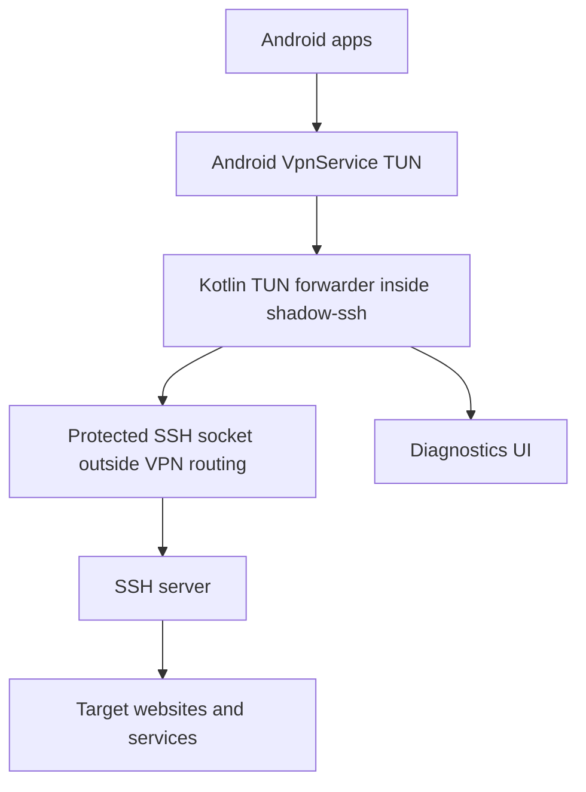
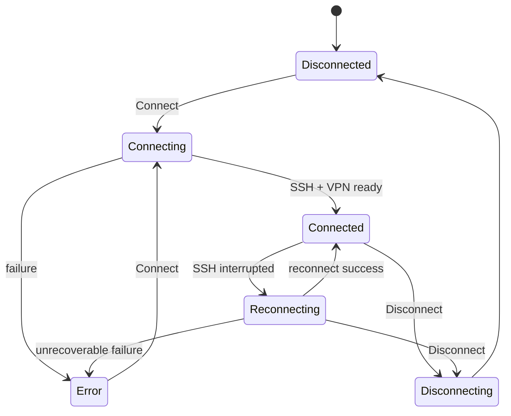

# shadow-ssh - описание для системного аналитика

## Назначение

`shadow-ssh` - Android-приложение, которое создаёт локальный VPN-интерфейс на устройстве и использует SSH-сервер как транспорт до внешних сайтов и сервисов.

Цель пользователя: выбрать SSH-конфигурацию, подключиться и направить сетевой трафик приложений через SSH-туннель без изменения серверной части.

## Участники

- Пользователь Android-устройства.
- Android OS:
  - выдаёт VPN permission;
  - создаёт `VpnService` TUN interface;
  - применяет split tunneling по package names;
  - отображает Quick Settings tile.
- Приложение `shadow-ssh`.
- SSH-сервер пользователя.
- Внешние сайты и сервисы.

## Общая схема трафика



Приложение защищает SSH socket от попадания обратно в VPN routing. Иначе SSH-соединение начало бы маршрутизироваться через собственный VPN-интерфейс и соединение могло бы зависнуть или оборваться.

## Основной сценарий подключения

1. Пользователь создаёт или выбирает SSH-конфигурацию.
2. Пользователь добавляет SSH private key или пароль.
3. Пользователь нажимает `Connect`.
4. Приложение проверяет:
   - выбрана ли конфигурация;
   - есть ли VPN permission;
   - если выбран режим `Selected apps`, выбран ли хотя бы один package.
5. Приложение открывает защищённый TCP socket до SSH-сервера.
6. SSH-клиент проходит аутентификацию.
7. Android создаёт VPN TUN interface.
8. Приложение запускает Kotlin TUN forwarding layer с текущей SSH-сессией.
9. TCP-трафик приложений открывается через SSH `direct-tcpip`.
10. DNS-запросы обрабатываются как DNS-over-TCP через SSH.
11. Статус на главном экране становится `Connected`.

## Режимы VPN

### Proxy

Через туннель идут все приложения, которые Android направляет в VPN.

Использование: режим по умолчанию для пользователя, которому нужен полный VPN.

### Selected apps

Через туннель идут только выбранные приложения.

Особенности:

- список приложений включает пользовательские и системные приложения;
- есть поиск;
- выбор сохраняется после перезапуска;
- если список пустой, подключение запрещается и показывается сообщение `нет выбранных приложений`;
- при изменении списка или режима во время активного VPN приложение делает controlled reconnect.

## Состояния подключения



Reconnect продолжается до явного `Disconnect`.

При обычном разрыве SSH приложение не закрывает Android VPN interface:

1. Статус меняется на `Reconnecting`.
2. Kotlin TUN forwarder отвязывается от старой SSH-сессии и закрывает связанные с ней TCP flow.
3. Первый SSH reconnect запускается без искусственной задержки.
4. После успешной аутентификации новая JSch `Session` подставляется в существующий forwarder.
5. Статус возвращается в `Connected`.

Повторные неудачи используют backoff от 250 ms до 5 секунд. SSH reconnect использует timeout 8 секунд. Если VPN interface или TUN forwarder недоступен, приложение выполняет полный rebuild pipeline.

Существующие TCP/TLS flow не переносятся между SSH-сессиями и должны быть переоткрыты клиентским приложением. Новые SYN во время короткой паузы временно не отклоняются, поэтому TCP stack Android может повторить их после восстановления transport.

### Возврат из Doze/блокировки экрана

SSH transport может оставаться доступным после сна устройства, пока отдельные TCP/TLS/DoT соединения приложений уже стали недействительными из-за NAT timeout или приостановки сети. Поэтому успешный `Check tunnel` сам по себе не гарантирует жизнеспособность старых app sockets.

Если экран был выключен не менее 60 секунд, приложение событийно проверяет текущие TUN-сессии и сбрасывает только те, которые простаивали не менее 30 секунд. Клиенты получают TCP RST и создают новые соединения через уже работающие VPN interface и SSH session. Недавно активные фоновые соединения сохраняются.

Механизм не использует wake lock, периодические ping или новый polling и не будит устройство во время сна.

## Диагностика

Diagnostics нужны для пользовательского debug без adb.

Пишутся:

- выбранная конфигурация без секретов;
- auth type;
- Android network capabilities;
- результат защиты SSH socket;
- SSH connect/auth lifecycle;
- fingerprint server/key;
- reconnect attempts;
- tunnel check result;
- terminal lifecycle/failures;
- forwarding layer warnings.

Не пишутся:

- private key;
- password;
- passphrase;
- terminal commands;
- terminal remote output.

Diagnostics по умолчанию скрыты на главном экране. В Settings есть переключатель `Debug logs`. Если он включён, на главном экране появляется свёрнутый блок diagnostics с кнопкой копирования.

## Check tunnel

Кнопка `Check tunnel` доступна после успешного подключения.

Проверка открывает SSH `direct-tcpip` channel до:

```text
youtube.com:443
```

Результат отображается цветом кнопки:

- серый - проверка ещё не выполнялась;
- зелёный - проверка успешна;
- красный - проверка неуспешна.

## SSH terminal

Terminal - дополнительный пользовательский инструмент, доступный при активном подключении.

Функция выключена по умолчанию и включается persisted-переключателем `SSH terminal` в Settings. Когда она выключена, terminal panel не создаётся, shell-channel не открывается, а уже активная terminal session немедленно закрывается.

Поведение:

- открывает SSH shell-channel на текущей SSH-сессии;
- работает в expandable panel на главном экране;
- ввод команд выполняется через Android keyboard;
- network write выполняется на IO-потоке, не на UI thread;
- при Disconnect shell-channel закрывается;
- terminal output хранится только в UI state и не попадает в diagnostics.

Терминал не является отдельным VPN-транспортом. Он использует ту же SSH-сессию, что и VPN.

## Хранение данных

Обычные данные:

- SSH configuration metadata;
- SSH key metadata;
- selected config;
- settings;
- selected app package names.

Секреты:

- SSH password;
- private key;
- private key passphrase.

Секреты не хранятся в Room. В Room хранится только secret id.

Активная схема secret storage:

- Tink AEAD;
- ciphertext в обычном private `SharedPreferences`;
- Base64 encoding;
- associated data = secret id;
- keyset через Android Keystore-backed `AndroidKeysetManager`.

Есть legacy migration из старого `EncryptedSharedPreferences`. Deprecated storage используется только как источник старых данных во время миграции.

В формах password, private key content и passphrase маскируются звёздочками по умолчанию. Кнопка глаза меняет только отображение текущего UI-поля и не изменяет способ хранения. Копирование private key/passphrase выполняется напрямую в Android clipboard и не попадает в diagnostics.

## UI settings

Настройки сохраняются после перезапуска приложения:

- `Debug logs`;
- `SSH terminal`;
- theme mode:
  - `System`;
  - `Light`;
  - `Dark`;
  - `Custom`;
- RGB-цвета для `Custom`;
- VPN mode;
- selected app package names.

## Quick Settings tile

Android Quick Settings tile называется `shadow-ssh`.

Поведение:

- если VPN подключён, подключается или переподключается - тап отправляет Disconnect;
- если VPN отключён - тап запускает текущую выбранную конфигурацию;
- если требуется действие пользователя, открывается главный экран.

Tile нельзя автоматически добавить в шторку или поставить в конкретную позицию. Это ограничение Android.

## Обновление приложения

При запуске главного экрана приложение автоматически проверяет GitHub Releases, но не чаще одного раза в 24 часа. В Settings также доступна ручная проверка.

Сценарий:

1. Выполняется публичный запрос `GET /repos/stansful/ssh-vpn-client-kotlin/releases/latest` без GitHub token.
2. `tag_name` сравнивается с установленным `versionName` по SemVer; поддерживаются tags с префиксом `v` и без него.
3. Если версия новее, показывается modal с release notes и действиями `Later`, `Open release`, `Download`; для уже проверенного APK действие меняется на `Install`.
4. `Open release` использует полученный от GitHub `html_url`.
5. `Download` передаёт `browser_download_url` системному DownloadManager. UI показывает процент и объём скачанных данных в сворачиваемой панели; системное скачивание продолжает работать независимо от открытого экрана.
6. После скачивания проверяются digest, package name, versionName, versionCode и signing certificate. Валидный APK и metadata сохраняются как `ReadyToInstall` после пересоздания процесса.
7. `Install` при необходимости направляет пользователя в системное разрешение `Install unknown apps`, затем передаёт APK стандартному Android installer, где пользователь подтверждает обновление.

Metadata проверки, незавершённой загрузки и проверенного APK сохраняются после пересоздания процесса. Ручная кнопка проверки остаётся доступной во время скачивания и визуально показывает выполняемую проверку. Одновременные network checks и повторные download jobs не дублируются. Прогресс опрашивается только во время активной загрузки и с более редким интервалом в paused-состоянии. Сетевые, JSON, hash и package операции выполняются вне Main thread.

Ограничения:

- Android не разрешает обычному приложению полностью бесшумную установку; требуется системное пользовательское подтверждение.
- Новый APK должен иметь больший `versionCode` и тот же signing certificate.
- Все production releases должны подписываться одним постоянным keystore.

## Технические ограничения

- Поддержаны TCP и DNS UDP/53.
- Произвольный non-DNS UDP не проксируется.
- SSH-серверная часть не меняется.
- Производительность зависит от:
  - latency до SSH-сервера;
  - производительности устройства;
  - cipher/KEX SSH-сессии;
  - количества параллельных TCP-соединений;
  - сетевых ограничений оператора или Wi-Fi.
- Интерактивный terminal зависит от shell defaults на сервере.

## Производительность и устойчивость

- Тяжёлые компоненты Room, Tink и VPN создаются лениво, поэтому не блокируют холодный старт до фактической необходимости.
- UI-экраны читают только metadata. Расшифровка password/private key происходит на IO-потоке только для подключения или редактирования.
- Diagnostics не ограничены по количеству строк до следующего Connect, но обрабатываются пакетно и показываются виртуализированным списком.
- Неактивные Compose-экраны прекращают сбор Flow по lifecycle.
- Поиск приложений имеет debounce 200 ms, а результат PackageManager кэшируется на 5 минут.
- Смена режима VPN или selected apps при активном соединении объединяется в один controlled reconnect; параллельные reconnect-задачи не создаются.
- SSH terminal и VPN connection loop выполняют блокирующий I/O вне UI-потока и отменяются вместе с владельцем lifecycle/service.
- В production-коде отсутствуют `GlobalScope` и `runBlocking`.

Pagination для app picker не применяется: Android `PackageManager` возвращает локальный snapshot без page API, а отображение большого списка виртуализировано.

## Сборочные артефакты

Debug APK:

```text
build/app/outputs/apk/debug/app-debug.apk
```

Release APK:

```text
build/app/outputs/apk/release/app-release.apk
```

Release APK:

- локально подписывается автоматически, если production signing env не задан;
- использует R8 minification;
- использует resource shrinking;
- проверяется через `apksigner verify --verbose`.

## Acceptance checklist

- Пользователь может создать SSH-конфигурацию.
- Пользователь может добавить private key без passphrase.
- Connect создаёт VPN и SSH-сессию.
- Disconnect останавливает VPN.
- При обрыве SSH приложение сохраняет Android VPN interface и переподключает SSH transport.
- При недоступном TUN forwarder приложение выполняет полный fallback rebuild.
- В `Selected apps` без выбранных приложений Connect запрещён.
- Diagnostics копируются в clipboard.
- Check tunnel меняет состояние кнопки.
- Terminal принимает команды без `NetworkOnMainThreadException`.
- Release APK устанавливается на устройство.
